# ROS to Prism Migration Record

## Executive summary and boundary

The ROS 1 application interface has been replaced by Prism messaging. The C++ detector driver, the four Python processing nodes, command/control flows, live tools, launcher, build, dependencies, Docker packaging, tests, and operational documentation now use Prism publishers/receivers and command channels. The shipped deployment enables Prism's NATS transport.

**The detector-side boundary did not move.** The GeGi detector still connects over raw TCP to `socket_comms::TcpEventReader`, which still implements the vendor command bytes, response extraction, and binary event-packet parsing. Only messaging between the C++ driver and the wider application/network changed. In particular, [`src/phds_gegi_driver/socket_comms/tcp_event_reader.cpp`](../src/phds_gegi_driver/socket_comms/tcp_event_reader.cpp) changed only by removing an unused `#include <ros/ros.h>`; its detector command protocol and packet parsing are otherwise unchanged by this migration.

The canonical implementation references are:

- C++ schemas and command helper: [`include/phds_gegi_driver/messages.hpp`](../include/phds_gegi_driver/messages.hpp), [`include/phds_gegi_driver/command_channel.hpp`](../include/phds_gegi_driver/command_channel.hpp)
- Python schemas and command helper: [`src/phds_gegi_driver/prism_messages.py`](../src/phds_gegi_driver/prism_messages.py), [`src/phds_gegi_driver/prism_command_channel.py`](../src/phds_gegi_driver/prism_command_channel.py)
- Driver: [`src/phds_gegi_driver/prism_phds_gegi_driver/phds_gegi_driver.cpp`](../src/phds_gegi_driver/prism_phds_gegi_driver/phds_gegi_driver.cpp), [`src/phds_gegi_driver/prism_phds_gegi_driver/main.cpp`](../src/phds_gegi_driver/prism_phds_gegi_driver/main.cpp)
- Day-to-day build and operation: [`README.md`](../README.md)

## Architecture before and after

```mermaid
flowchart TB
    subgraph Before[Before: ROS 1 application graph]
        D1[PHDS GeGi detector]
        S1[socket_comms TcpEventReader]
        R1[ROS C++ driver and nodelet]
        G1[ROS topics and services]
        P1[ROS Python spectrum activity heatmap recorder nodes]
        B1[rosbag files]
        W1[rosbridge websocket]
        T1[Windows and plotting tools]

        D1 -->|Vendor TCP binary protocol| S1
        S1 --> R1
        R1 -->|ROS messages| G1
        G1 -->|ROS services| R1
        G1 <--> P1
        P1 --> B1
        G1 --> W1
        W1 --> T1
    end

    subgraph After[After: Prism application graph]
        D2[PHDS GeGi detector]
        S2[socket_comms TcpEventReader]
        C2[Prism C++ driver]
        M2[Prism Application and MessagingFactory]
        N2[NATS transport in shipped build]
        P2[Prism Python spectrum activity heatmap recorder nodes]
        J2[JSONL N42 CSV and manifest files]
        T2[Prism CLI and native plotting tools]

        D2 -->|Same vendor TCP binary protocol| S2
        S2 --> C2
        C2 <--> M2
        P2 <--> M2
        M2 <--> N2
        N2 <--> T2
        P2 --> J2
    end
```



## Why commands use pub/sub rather than RPC

Prism's protocol-agnostic `Application`/`MessagingFactory` layer has no RPC or request/reply primitive. NATS has a native request/reply convention, but using it directly would make application code NATS-specific and would break `--protocol` portability.

Every former service is therefore represented by ordinary pub/sub topics:

- `<namespace>.command`: caller publishes a JSON command.
- `<namespace>.command_result`: server publishes a JSON `CommandResult`.
- `request_id` is optional. If supplied by the caller, the server echoes it in the result.

`CommandServer` dispatches on the command message's `command` field. `CommandClient` is only a **local correlation and waiting convenience**: it generates a `request_id`, publishes to the command topic, subscribes to the result topic, and waits on a local condition variable or `threading.Event` for the matching result. It does not invoke backend RPC and provides no stronger delivery guarantee than the underlying ordinary pub/sub messages.

The implementation is shared across languages in [`include/phds_gegi_driver/command_channel.hpp`](../include/phds_gegi_driver/command_channel.hpp) and [`src/phds_gegi_driver/prism_command_channel.py`](../src/phds_gegi_driver/prism_command_channel.py).

## ROS to Prism interface mapping

All JSON rows below are UTF-8 JSON sent through Prism text endpoints unless explicitly marked as plain text or binary. `Spectrum.spectrum` contains **per-publication interval deltas**, not a cumulative histogram.

### Data and state topics

| Old ROS interface and format | New Prism topic and format | Implemented behavior |
|---|---|---|
| `/compton_event` — `radiation_detector_msgs/ComptonEvent` | `gegi.driver.compton_event` — JSON `ComptonEvent` | One message for each accepted two-site Compton event. |
| `/energy_deposit` — `std_msgs/Float64` | `gegi.driver.energy_deposit` — JSON Prism `DoubleValue` | Single-site energy, plus summed two-site energy for accepted Compton events. |
| `/energy_deposit_singles` — `std_msgs/Float64` | `gegi.driver.energy_deposit_singles` — JSON Prism `DoubleValue` | Single-site energy only. |
| `/spectrum` — `radiation_detector_msgs/Spectrum` | `gegi.spectrum.histogram` — JSON `Spectrum` | Main per-interval delta spectrum; default 4 Hz. |
| `/spectrum_singles` — `radiation_detector_msgs/Spectrum` | `gegi.spectrum_singles.histogram` — JSON `Spectrum` | Second `spectrum_node.py` instance driven from `gegi.driver.energy_deposit_singles`. |
| `/detector/dead_time_percent` — `std_msgs/Float64`, optionally latched by a spectrum node | `gegi.detector.dead_time_percent` — JSON Prism `DoubleValue` | C++ driver publishes only when the corresponding `RunInfo` sample is valid. Spectrum nodes may optionally consume or publish this topic through CLI flags. |
| `/detector/get_run_info` — `GetRunInfo` service | `gegi.detector.run_info` — JSON `RunInfo` state topic | Periodically published state replaces an on-demand query. |
| `/detector/get_detector_info` — `GetDetectorInfo` service | `gegi.detector.detector_info` — JSON `DetectorInfo` state topic | Periodically published state; bounded last-valid fallback is identified by `cached`. |
| `/sphere_heatmap` — `sensor_msgs/PointCloud2` | `gegi.heatmap.cloud` — binary point array **and** `gegi.heatmap.cloud_meta` — JSON metadata | PointCloud2 is split into a raw 28-byte/point payload and a separately published layout header. |
| `/source_direction` — `geometry_msgs/PoseStamped` | `gegi.heatmap.source_direction` — raw JSON `source_direction` | Strongest sphere-grid peak. |
| `/source_directions` — `geometry_msgs/PoseArray` | `gegi.heatmap.source_directions` — raw JSON `source_directions` | Detected source points; each point also carries `isotope` and supporting event `count`. |
| `/source_isotopes` — `std_msgs/String` | `gegi.heatmap.source_isotopes` — plain UTF-8 text | `none` or pipe-separated labels such as `Cs-137:150|Co-60:45`. |
| `/activity/total_activity` — `std_msgs/Float64` | `gegi.activity.total_activity` — JSON Prism `DoubleValue` | Sum of valid source activities in MBq, combining same-nuclide lines. |
| `/activity/results` — `std_msgs/String` containing JSON | `gegi.activity.results` — raw JSON object | Detailed per-window activity report; no `dataType` wrapper. |
| `/activity/effective_source_distance` — latched `std_msgs/Float64` | `gegi.activity.effective_source_distance` — JSON Prism `DoubleValue` | Published initially, on change, and every 5 seconds. |
| `/activity/source_distance` — `std_msgs/Float64` | `gegi.activity.source_distance` — JSON Prism `DoubleValue` | Dynamic source-distance input in metres. |
| `/activity/n_shielding_plates` — `std_msgs/Int32` | `gegi.activity.n_shielding_plates` — JSON Prism `IntValue` | Non-negative operator plate-count input. |

### Detector services and commands

All five detector actions below share `gegi.detector.command` for commands and `gegi.detector.command_result` for `CommandResult` messages.

| Old ROS service | New command JSON on `gegi.detector.command` | Result |
|---|---|---|
| `/detector/start_acquisition` | `{"command":"start_acquisition"}` | `gegi.detector.command_result` |
| `/detector/stop_acquisition` | `{"command":"stop_acquisition"}` | `gegi.detector.command_result` |
| `/detector/clear_data` | `{"command":"clear_data"}` | `gegi.detector.command_result` |
| `/detector/toggle_bias_mode` | `{"command":"toggle_bias_mode"}` | `gegi.detector.command_result` |
| `/detector/start_timed_acquisition` | `{"command":"start_timed_acquisition","duration_minutes":5}` | `gegi.detector.command_result`; supported durations are 5, 10, 15, 20, 25, 30, 45, and 60 minutes. |

The former `/detector/get_run_info` and `/detector/get_detector_info` services are not commands; they became the periodic state topics in the previous table.

### Processing-node and recorder services

| Old ROS service | New Prism command topic | Commands | Result topic |
|---|---|---|---|
| `/spectrum/clear` | `gegi.spectrum.command` | `clear` | `gegi.spectrum.command_result` |
| `/spectrum_singles/clear` | `gegi.spectrum_singles.command` | `clear` | `gegi.spectrum_singles.command_result` |
| `/spherical_heatmap/clear`, `/spherical_heatmap/save_csv` | `gegi.spherical_heatmap.command` | `clear`, `save_csv` | `gegi.spherical_heatmap.command_result` |
| `/activity/clear` | `gegi.activity.command` | `clear` | `gegi.activity.command_result` |
| `/data_recorder/start_timed_recording`, `/data_recorder/stop_recording`, `/data_recorder/clear_all` | `gegi.data_recorder.command` | `start_timed_recording` with `duration_minutes`, `stop_recording`, `clear_all` | `gegi.data_recorder.command_result` |

The implemented heatmap command namespace is **`gegi.spherical_heatmap.command`**, not `gegi.heatmap.command`. `clear_all` correlates ordinary command/result messages while fanning out to detector clear plus `gegi.spherical_heatmap.command`, `gegi.spectrum.command`, `gegi.spectrum_singles.command`, and `gegi.activity.command`.

## Wire schemas

All `stamp` values, and activity report `timestamp` values, are `double` Unix epoch seconds. There is no ROS `Time` or simulated-clock representation. Integer widths shown for C++ custom schemas are their declared widths; JSON itself carries numbers without a wire-level integer width.

### `DoubleValue`

```json
{
  "dataType": "DoubleValue",
  "value": 12.5
}
```

### `IntValue`

```json
{
  "dataType": "IntValue",
  "value": 3
}
```

### `ComptonEvent`

`seq` is a `uint32`; positions are metres and energies are keV.

```json
{
  "dataType": "ComptonEvent",
  "stamp": 1784721600.125,
  "frame_id": "detector",
  "seq": 42,
  "energy_kev_1": 210.5,
  "reading_location_1": {
    "x": 0.012,
    "y": -0.004,
    "z": 0.001
  },
  "energy_kev_2": 451.5,
  "reading_location_2": {
    "x": 0.018,
    "y": -0.002,
    "z": -0.003
  },
  "cone_angle": 0.785398,
  "cone_angle_uncertainty": 0.04
}
```

### `Spectrum`

`seq`, `real_time_ms`, `dead_time_ms`, `total_count`, and every `spectrum` entry are `uint32`. `end_time` is also Unix epoch seconds. The short array is illustrative; production length follows the calibration bins.

```json
{
  "dataType": "Spectrum",
  "stamp": 1784721600.25,
  "frame_id": "detector",
  "seq": 17,
  "end_time": 1784721600.25,
  "real_time_ms": 250,
  "dead_time_ms": 5,
  "total_count": 6,
  "spectrum": [0, 1, 0, 3, 2, 0]
}
```

### `RunInfo`

```json
{
  "dataType": "RunInfo",
  "valid": true,
  "real_time_sec": 300.0,
  "live_time_sec": 294.6,
  "dead_time_percent": 1.8,
  "count_rate_hz": 1250.0,
  "message": "Run info retrieved",
  "stamp": 1784721600.5
}
```

### `DetectorInfo`

```json
{
  "dataType": "DetectorInfo",
  "valid": true,
  "serial_number": "G596",
  "detector_temp_kelvin": 92.4,
  "detector_bias_status": 1,
  "line_power_status": 1,
  "batt1_percent": 87,
  "batt2_percent": 82,
  "message": "Detector info retrieved",
  "stamp": 1784721600.5,
  "cached": false
}
```

### `Command`

Commands have no `dataType` field. Additional parameters are command-specific, and `request_id` is optional.

```json
{
  "command": "start_timed_acquisition",
  "duration_minutes": 5,
  "request_id": "caller-123"
}
```

### `CommandResult`

`request_id` is omitted when the command did not provide one.

```json
{
  "dataType": "CommandResult",
  "command": "start_timed_acquisition",
  "success": true,
  "message": "5-minute acquisition started",
  "stamp": 1784721600.75,
  "request_id": "caller-123"
}
```

### `source_direction`

This raw JSON object has no `dataType`. `x`, `y`, and `z` are the strongest point on the current sphere in metres.

```json
{
  "stamp": 1784721602.0,
  "frame_id": "detector",
  "x": 0.482,
  "y": 0.121,
  "z": -0.049
}
```

### `source_directions`

This raw JSON object has no `dataType`. Its points are source-plane coordinates; `x` is the current effective source distance, while `y` and `z` are obtained by ray-plane intersection. `count` is the isotope-band event count used by the current heatmap update.

```json
{
  "stamp": 1784721602.0,
  "frame_id": "detector",
  "points": [
    {
      "x": 0.5,
      "y": 0.126,
      "z": -0.051,
      "isotope": "Cs-137",
      "count": 150
    },
    {
      "x": 0.5,
      "y": -0.084,
      "z": 0.032,
      "isotope": "Co-60",
      "count": 45
    }
  ]
}
```

### `cloud_meta`

This raw JSON object has no `dataType`. Metadata is published immediately before its corresponding binary cloud, but it remains a separate pub/sub message.

```json
{
  "stamp": 1784721602.0,
  "frame_id": "detector",
  "point_step": 28,
  "n_points": 4000,
  "fields": [
    "x",
    "y",
    "z",
    "rgb",
    "intensity",
    "cs137",
    "co60"
  ]
}
```

### Binary cloud layout

Each point is exactly **28 bytes**, with no padding: seven contiguous 4-byte fields.

| Offset | Size | Advertised field | Wire interpretation |
|---:|---:|---|---|
| 0 | 4 | `x` | IEEE-754 `float32`, little-endian, metres |
| 4 | 4 | `y` | IEEE-754 `float32`, little-endian, metres |
| 8 | 4 | `z` | IEEE-754 `float32`, little-endian, metres |
| 12 | 4 | `rgb` | Bits `0x00RRGGBB`, stored by reinterpreting that 32-bit word as a `float32`; consumers that need color read the same four bytes as little-endian `uint32` |
| 16 | 4 | `intensity` | IEEE-754 `float32`, little-endian, maximum of the per-isotope published scores |
| 20 | 4 | `cs137` | IEEE-754 `float32`, little-endian, Cs-137 published score |
| 24 | 4 | `co60` | IEEE-754 `float32`, little-endian, Co-60 published score |

The producer currently uses Python `struct.pack_into('f', ...)` and native `I`/`f` reinterpretation, while all included consumers decode with `<f`/`<I`. On the supported amd64 Docker/host deployment this is little-endian and yields the layout above. A big-endian producer would need explicit little-endian format strings to preserve this contract. RGB is visualization-only. When a positive activity result is available, each isotope score is scaled to dose rate in µSv/h; otherwise the implementation uses a gamma-constant-weighted relative fallback, so consumers must not assume absolute dose units in that fallback state. Values below 10% of the current combined peak are zeroed in all three published score fields.

### `activity_results`

Published on `gegi.activity.results`. This raw JSON object has no `dataType` -- the one GeGi message that predates that convention. `isotopes[].hotspot_offset_m`/`slant_distance_m` are present only when a fresh imaged hotspot was used for that line's position correction (`position_corrected: true`); otherwise those two keys are simply absent, not zeroed. A first-class typed contract (`psm::types::ActivityResult`/`ActivityIsotopeResult`, adding a `dataType` for registry consistency only) now exists in `include/prism/types/gegi.hpp` alongside the other nine GeGi types -- see the note at the top of this section.

```json
{
  "timestamp": 1784721600.0,
  "real_time_s": 300.0,
  "live_time_s": 294.0,
  "dead_time_fraction": 0.02,
  "dead_time_status": "valid",
  "dt_correction_factor": 1.020408,
  "source_distance_m": 0.58,
  "solid_angle_fraction": 0.001498,
  "total_activity_MBq": 1.42,
  "isotopes": [
    {
      "isotope": "Cs-137",
      "energy_keV": 661.7,
      "intrinsic_efficiency": 0.02,
      "solid_angle_fraction": 0.001498,
      "absolute_efficiency": 3.0e-5,
      "efficiency_product": 2.9e-5,
      "source_distance_m": 0.58,
      "n_shielding_plates": 0,
      "total_shield_plates": 0,
      "shield_transmission": 1.0,
      "position_corrected": true,
      "position_factor": 0.94,
      "method": "intrinsic_efficiency",
      "gross_counts": 5200.0,
      "background_counts": 400.0,
      "net_peak_area": 4800.0,
      "net_corrected": 4898.0,
      "sigma_counts": 74.6,
      "activity_MBq": 1.02,
      "sigma_activity_MBq": 0.03,
      "count_rate_cps": 16.66,
      "valid": true,
      "below_min_counts": false,
      "hotspot_offset_m": 0.18,
      "slant_distance_m": 0.605
    }
  ]
}
```

## State publication behavior

### C++ detector state

The driver starts a background loop after connecting to the detector and starting its command receiver. Every loop:

1. Queries and publishes `gegi.detector.run_info`.
2. Publishes `gegi.detector.dead_time_percent` only when that `RunInfo` is valid.
3. Queries and publishes `gegi.detector.detector_info`.
4. Sleeps using the locally tracked acquisition state.

The defaults from [`main.cpp`](../src/phds_gegi_driver/prism_phds_gegi_driver/main.cpp) are:

- Idle: `--idle-poll-interval-sec 2.0`.
- Acquisition active: `--busy-poll-interval-sec 30.0`.
- Detector-info cache maximum age: `--detector-info-cache-max-age-sec 120.0`.

The driver validates run timing/ranges and temporal progression. It may sanitize an inconsistent raw dead-time value from real/live times, but it never publishes the standalone `dead_time_percent` topic from an invalid run-info sample. Invalid run-info fields are marked invalid rather than treated as authoritative. Detector info can use the last valid sample within the configured cache age; `cached: true` makes that fallback explicit.

`acquisition_active` is driver-local command tracking. It becomes true after a successful `start_acquisition` or `start_timed_acquisition` send, and false after a successful `stop_acquisition` send. This controls only the 2-second versus 30-second state-query interval; it is not independently read back from detector state.

**Timed-acquisition caveat:** successful timed start sets `acquisition_active` true, but preset expiry does not automatically clear that flag. Natural expiry therefore leaves state polling at the busy 30-second interval until a successful explicit `stop_acquisition` command or driver restart. An early recorder stop does issue `stop_acquisition`; the recorder's normal timer-expiry path relies on detector preset completion and does not issue a stop command.

Run-info and detector-info requests use the detector control connection while event data streams through the existing event connection. Both reach the same detector firmware, so the 30-second busy interval retains the previous conservative policy for avoiding control-query interference with acquisition throughput.

### Effective source distance in place of ROS latching

The ROS activity node used a latched `/activity/effective_source_distance`. Prism has no equivalent latch in this implementation. The activity node now publishes `gegi.activity.effective_source_distance`:

- once during initialization;
- whenever source distance or shielding-plate count changes enough to update the effective distance; and
- every 5 seconds from a background republish thread.

The heatmap and recorder cache the latest value. This periodic republish lets late joiners converge, but it is not durable retained state and introduces up to approximately one republish period of delay for a late subscriber.

## File-by-file change inventory

### Removed ROS packaging, launch, services, and nodelet artifacts

- Deleted `package.xml` and `phds_gegi_driver.xml`.
- Deleted all ROS service definitions under `srv/`: `ClearData.srv`, `GetDetectorInfo.srv`, `GetRunInfo.srv`, `StartAcquisition.srv`, `StartTimedAcquisition.srv`, `StopAcquisition.srv`, and `ToggleBiasMode.srv`.
- Deleted `launch/activity.launch`, `launch/data_recorder.launch`, `launch/gegi_driver.launch`, `launch/gegi_full_pipeline.launch`, `launch/spectrum.launch`, and `launch/spherical_heatmap.launch`.
- Deleted the old `src/phds_gegi_driver/ros_phds_gegi_driver/` driver, standalone ROS node, and nodelet implementation.
- Removed catkin message/service generation, ROS/nodelet/pluginlib dependencies, nodelet target, and catkin install/test integration from [`CMakeLists.txt`](../CMakeLists.txt).
- The vendored `deps/radiation_detector_msgs` directory remains in the tree, but the top-level Prism build no longer consumes it.

### Added or migrated C++ messaging

- [`CMakeLists.txt`](../CMakeLists.txt): standalone CMake/C++20 build; adds vendored Prism, enables NATS, disables the other Prism transports and language bindings in this build tree, and links the driver to `prism_messaging`.
- [`.gitmodules`](../.gitmodules) and `deps/prism`: add Prism and its nested dependencies as a submodule.
- [`include/phds_gegi_driver/messages.hpp`](../include/phds_gegi_driver/messages.hpp): adds shared C++ JSON schemas and Unix-epoch timestamp helper.
- [`include/phds_gegi_driver/command_channel.hpp`](../include/phds_gegi_driver/command_channel.hpp): adds portable pub/sub `CommandServer` and correlation-only `CommandClient`.
- [`include/phds_gegi_driver/phds_gegi_driver.hpp`](../include/phds_gegi_driver/phds_gegi_driver.hpp): replaces ROS publishers/services with Prism senders, a command server, state thread, validation history, cache, and acquisition tracking.
- [`src/phds_gegi_driver/prism_phds_gegi_driver/phds_gegi_driver.cpp`](../src/phds_gegi_driver/prism_phds_gegi_driver/phds_gegi_driver.cpp): publishes JSON event/energy/state payloads, handles detector commands, and periodically publishes validated state.
- [`src/phds_gegi_driver/prism_phds_gegi_driver/main.cpp`](../src/phds_gegi_driver/prism_phds_gegi_driver/main.cpp): replaces ROS node/nodelet startup with one `psm::Application` executable and Prism connection lifecycle.
- [`src/phds_gegi_driver/socket_comms/tcp_event_reader.cpp`](../src/phds_gegi_driver/socket_comms/tcp_event_reader.cpp): only the unused ROS include was removed. Vendor command characters, packet sizes/layouts, socket behavior, and response parsing remain unchanged by this migration.

### Shared Python messaging and processing nodes

- [`src/phds_gegi_driver/prism_messages.py`](../src/phds_gegi_driver/prism_messages.py): Python-side scalar/custom JSON builders and parsers matching the C++ schemas. Consistency is manual, not code-generated.
- [`src/phds_gegi_driver/prism_command_channel.py`](../src/phds_gegi_driver/prism_command_channel.py): Python pub/sub command server/client with optional `request_id` correlation.
- [`src/phds_gegi_driver/spectrum_node.py`](../src/phds_gegi_driver/spectrum_node.py): replaces ROS parameters, messages, timer, service, and run-info proxy with Prism options, receivers/senders, a thread, command topics, and asynchronous state subscriptions. Main and singles instances use the same node implementation.
- [`src/phds_gegi_driver/spherical_heatmap_node.py`](../src/phds_gegi_driver/spherical_heatmap_node.py): replaces ROS messages/timer/services with Prism endpoints, publishes binary cloud plus metadata and raw JSON directions, and uses `gegi.spherical_heatmap.command`.
- [`src/phds_gegi_driver/activity_node.py`](../src/phds_gegi_driver/activity_node.py): replaces ROS messages/service/timer with Prism endpoints, `DoubleValue`/`IntValue`, command topics, and 5-second distance republishing in place of a ROS latch.
- [`src/phds_gegi_driver/data_recorder_node.py`](../src/phds_gegi_driver/data_recorder_node.py): replaces service proxies and rosbag with command clients, continuous state subscriptions, JSONL event capture, binary cloud parsing, and linked output assets.

### Configuration, launcher, Docker, dependencies, tools, tests, and docs

- [`config/gegi_driver.yaml`](../config/gegi_driver.yaml): C++ driver endpoint-name overrides for `compton_event`, `energy_deposit`, `energy_deposit_singles`, `run_info`, `detector_info`, `dead_time_percent`, `command`, and `command_result`.
- [`scripts/run_full_pipeline.sh`](../scripts/run_full_pipeline.sh): replaces ROS launch XML with process orchestration for the driver, main/singles spectra, activity, heatmap, and recorder; handles child shutdown and environment overrides.
- [`docker/dockerfiles/phds_gegi_amd64`](../docker/dockerfiles/phds_gegi_amd64): replaces the ROS Melodic image/catkin build with an Ubuntu 22.04 multistage CMake build, a separate Prism Python binding installation, and the Prism-native launcher.
- [`docker/entrypoints/phds_gegi_entrypoint.sh`](../docker/entrypoints/phds_gegi_entrypoint.sh): removes ROS setup sourcing and establishes the Prism/Python module path.
- [`docker-compose.yml`](../docker-compose.yml): adds NATS 2 and the application service, with NATS connection environment and a persistent data volume.
- [`setup/phds_gegi_driver/setup_dependencies.sh`](../setup/phds_gegi_driver/setup_dependencies.sh): replaces ROS packages with C++/CMake/Ninja, Boost, libsodium, OpenCV, Python, NumPy, SciPy, PyYAML, Matplotlib, and binding build prerequisites.
- [`tools/deadtime_monitor.py`](../tools/deadtime_monitor.py): becomes a passive Prism `RunInfo` subscriber.
- [`tools/plot_live_spectrum.py`](../tools/plot_live_spectrum.py), [`tools/plot_live_heatmap.py`](../tools/plot_live_heatmap.py), and [`tools/plot_live_2d_heatmap.py`](../tools/plot_live_2d_heatmap.py): replace rosbridge/`roslibpy` with direct Prism connections and parse the new JSON/binary formats.
- [`tools/plot_spectrum.ps1`](../tools/plot_spectrum.ps1), [`tools/plot_heatmap.ps1`](../tools/plot_heatmap.ps1), and [`tools/plot_2d_heatmap.ps1`](../tools/plot_2d_heatmap.ps1): become Prism-native plotting launch wrappers.
- [`watch_gegi_topics.ps1`](../watch_gegi_topics.ps1): replaces ROS topic commands with Prism CLI `echo`/`hz`, on host or in a container.
- Other assay/analysis tools under [`tools/`](../tools/) remain file-oriented; they do not form part of the live ROS/Prism transport boundary.
- [`test/run_tests.sh`](../test/run_tests.sh): removes ROS/catkin setup and runs the Python suite with separately installed Prism bindings.
- [`test/test_spectrum.py`](../test/test_spectrum.py): updates the energy fixture from a `std_msgs/Float64` stand-in to encoded Prism `DoubleValue`.
- [`test/test_prism_messaging.py`](../test/test_prism_messaging.py): guards scalar/custom JSON schemas, command dispatch, `request_id` echoing, and client correlation over plain pub/sub; the broader physics, heatmap, N42, configuration, and analysis tests remain in place.
- [`README.md`](../README.md): replaces ROS/catkin/rosbridge instructions with Prism/NATS build, run, CLI, plotting, recording, and test guidance, and links to this record.

## Recorder migration: `.bag` to `.jsonl`

The recorder no longer imports `rosbag` or creates `*_compton_events.bag`. During an active recording it writes each received `gegi.driver.compton_event` JSON string as one line in `*_compton_events.jsonl`.

A completed recording can generate:

1. `*_compton_events.jsonl` — one `ComptonEvent` JSON object per line.
2. `*_spectrum.n42` — ANSI N42.42 spectrum with embedded activity analysis where available.
3. `*_activity.csv` — per-window/per-line activity and provenance fields.
4. `*_heatmap_raw.csv` — filtered irregular sphere points.
5. `*_heatmap_raster.csv` — regular Y-Z raster.
6. `*_heatmap_3d.csv` — source-plane hot-point grid.
7. `*_manifest.json` — measurement identity, configuration, detector run info, radionuclides, and generated-asset index.

JSONL is deliberately simple to parse and replay: read one line at a time, parse it as the documented `ComptonEvent`, and publish the line to `gegi.driver.compton_event` with a Prism text sender. Unlike rosbag, the JSONL file has no ROS connection metadata, topic index, bag clock, or automatic timing replay; a replay tool must choose pacing, normally from each event's Unix-epoch `stamp` or from an explicit test rate. No dedicated replay utility is included in this migration.

## Configuration, build, and run

For the maintained quick-start and CLI examples, use [`README.md`](../README.md). The essential migration-specific steps are summarized here.

### Submodules and native build

Prism has nested dependencies, so initialize recursively:

```bash
git submodule update --init --recursive
cmake -S . -B build -DCMAKE_BUILD_TYPE=Release
cmake --build build --parallel
```

The top-level CMake project builds the driver and Prism CLI against the vendored NATS backend while forcing `PSM_BUILD_PYTHON_BINDINGS=OFF`. The expected CMake outputs documented by the repository are `build/bin/phds_gegi_driver_node` and `build/bin/prism`.

Install the Python bindings separately, then install runtime packages:

```bash
python3 -m venv .venv
source .venv/bin/activate
python3 -m pip install --upgrade pip
python3 -m pip install ./deps/prism/bindings/python
python3 -m pip install numpy PyYAML scipy matplotlib
python3 -c "import prism; print(prism.__file__)"
```

### NATS and transport selection

Start a reachable NATS 2 server, for example:

```bash
nats-server
```

or:

```bash
docker run --rm -d --name gegi-nats -p 4222:4222 nats:latest
```

`--protocol nats` is a deployment choice passed to Prism; application code uses the protocol-agnostic `Application`/`MessagingFactory` APIs. The current top-level build intentionally compiles only the NATS transport, so using another Prism protocol would also require enabling and building that backend.

### Driver endpoint overrides

Pass the driver configuration with:

```bash
./build/bin/phds_gegi_driver_node \
  --protocol nats --server localhost --port 4222 \
  --config-file config/gegi_driver.yaml \
  --gegi-ip 192.168.50.109 --gegi-port 27015
```

[`config/gegi_driver.yaml`](../config/gegi_driver.yaml) overrides the C++ driver's endpoint destinations/sources by endpoint ID and `name`. The Python nodes primarily expose topics through their own CLI options or fixed constants; this YAML is specifically consumed by the driver's `Application` endpoint configuration.

### Full launcher

[`scripts/run_full_pipeline.sh`](../scripts/run_full_pipeline.sh) starts all six processes: C++ driver, main spectrum, singles spectrum, activity, spherical heatmap, and recorder. It accepts:

| Environment variable | Implemented default/purpose |
|---|---|
| `PRISM_PROTOCOL` | `nats` |
| `PRISM_SERVER` | `localhost` |
| `PRISM_PORT` | `4222` |
| `DETECTOR_IP` | `GEGI_IP` if set, otherwise `192.168.50.109` |
| `DETECTOR_PORT` | `GEGI_PORT` if set, otherwise `27015` |
| `OUTPUT_DIR` | `<project>/data` |
| `CALIBRATION_FILE` | `<project>/config/EnergyCal.csv` |
| `ISOTOPES_CONFIG` | `<project>/config/isotopes.yaml` |
| `DRIVER_EXECUTABLE` | `<project>/build/bin/phds_gegi_driver_node` |
| `PYTHON_EXECUTABLE` | `python3` |

The launcher always passes `<project>/config/gegi_driver.yaml` as the driver config. Its default driver executable matches the top-level CMake output at `build/bin/phds_gegi_driver_node`. The Docker image overrides `DRIVER_EXECUTABLE` with `/opt/phds_gegi_driver/bin/phds_gegi_driver_node`.

### Docker Compose

```bash
docker compose up --build
```

[`docker-compose.yml`](../docker-compose.yml) starts `nats:2-alpine`, builds the Ubuntu 22.04 application image, points it at host `nats:4222`, and persists recorder output in the `gegi-data` volume. A complete image build was not part of the validation recorded below.

## Validation performed

The following checks were run during the migration:

- Python syntax compilation passed:

  ```bash
  python3 -m py_compile src/phds_gegi_driver/*.py tools/deadtime_monitor.py tools/plot_live_spectrum.py tools/plot_live_heatmap.py tools/plot_live_2d_heatmap.py
  ```

- `bash test/run_tests.sh` passed **119 tests**, including the added Prism scalar/custom schema and pub/sub command-correlation tests. The run emitted a pre-existing `ResourceWarning` in `tools/position_check.py`.
- Shell syntax checks with `bash -n` passed for the launcher, test runner, dependency installer, and entrypoint: `scripts/run_full_pipeline.sh`, `test/run_tests.sh`, `setup/phds_gegi_driver/setup_dependencies.sh`, and `docker/entrypoints/phds_gegi_entrypoint.sh`.
- `docker compose config` passed.
- The Prism `prism_messaging` target built successfully on the host.
- The vendored Prism Python wheel built and installed successfully into an isolated target directory with `python3 -m pip install --target /tmp/prism127 ./deps/prism/bindings/python`.
- A live NATS smoke test passed cleanly against `nats:2-alpine`: the shared Python `CommandClient` published an ordinary command, `CommandServer` handled it, the correlated `CommandResult` was received, and receiver/connection teardown exited successfully. The command helpers explicitly detach their bound callbacks during shutdown to avoid nanobind reference cycles.
- A Prism-facing syntax check of the new C++ driver and `main` passed with a mock `TcpEventReader` include. That check caught and led to the fix of an invalid `SenderInterface::getDestination` use.
- A full host executable build is blocked in this environment by unchanged legacy `boost::asio::io_service` and `resolver::query` APIs in `tcp_event_reader` against installed Boost 1.90, where those APIs have been removed. This is not a Prism-facing compile failure. The Docker build is based on Ubuntu 22.04/Boost 1.74 and is the intended full-build environment.
- A full Docker image build was **not** run.
- A physical-detector end-to-end test was **not** run.

## Residual risks and operational notes

- The shared command channel was smoke-tested against NATS, but no full hardware-plus-NATS pipeline smoke test has been performed in situ. Detector command timing, sustained event throughput, and all downstream outputs still need validation on the deployed network and detector.
- Core pub/sub delivery is at-most-once where the selected protocol provides at-most-once semantics; in particular, core NATS does not persist or retry missed messages for late/disconnected subscribers. Commands and results should therefore use timeouts and operational retry policy where safe.
- Periodic state republishing replaces ROS durability/latching; it does not provide durable retained state. Late joiners wait for the next publication.
- `cloud_meta` and binary `cloud` are separate messages. Consumers must cache the latest metadata and skip or defer a binary cloud received before metadata; there is no transaction binding the pair.
- Custom JSON schema agreement is documented and hand-maintained between C++ and Python, not generated from one schema. Changes must keep [`messages.hpp`](../include/phds_gegi_driver/messages.hpp), [`command_channel.hpp`](../include/phds_gegi_driver/command_channel.hpp), [`prism_messages.py`](../src/phds_gegi_driver/prism_messages.py), consumers, and this document in lockstep.
  - **Partially resolved**: all ten message shapes (`Vec3`/`ComptonEvent`/`Spectrum`/`RunInfo`/`DetectorInfo`/`Command`/`CommandResult`/`SourceDirection(s)`/`CloudField`+`CloudMeta`/`ActivityResult`+`ActivityIsotopeResult`) have been added as first-class typed Prism contracts in `include/prism/types/gegi.hpp` and registered in `src/core/type_registrations.cpp` on the `feature/gegi-driver-types` branch of the `deps/prism` submodule (https://github.com/createc-uk/Prism/tree/feature/gegi-driver-types), pending upstream merge into `develop`. This makes every driver message decodable via Prism's generic `TypeRegistry`/`prism_app`/`prism_cli` tooling by any consumer, without needing this repo's headers. The C++ driver and Python nodes still use their own hand-rolled structs/dicts (field-name casing differs, e.g. `frame_id` vs `frameId`); rewiring them to consume `psm::types::*`/Python bindings directly is deferred future work once that branch merges and, for Python, a wheel with the new types is built (`PSM_BUILD_PYTHON_BINDINGS` is currently `OFF` for this driver). Wire-format compatibility between the hand-rolled schemas and the new `psm::types::*` definitions is enforced by [`test/test_prism_types_coverage.cpp`](../test/test_prism_types_coverage.cpp), a live-NATS integration test: build with `cmake --build build --target test_prism_types_coverage`, run an NATS server, then run `./build/test_prism_types_coverage` (returns exit code 77 if no NATS server is reachable, treated as skipped).
- Detector state queries use the existing detector control connection while acquisition data uses the existing event connection. The 30-second busy interval retains the conservative policy for reducing detector/firmware contention during acquisition.
- Timed-acquisition expiry does not clear the driver's local `acquisition_active` flag; see [State publication behavior](#state-publication-behavior).

- The binary cloud producer relies on native packing on the supported little-endian amd64 deployment, while consumers explicitly decode little-endian. Cross-endian deployment would require a producer fix.

## Migration-complete checklist

- [x] Detector TCP/vendor binary boundary preserved in `socket_comms`.
- [x] ROS driver topics/services replaced by Prism data, state, and command topics.
- [x] Main/singles spectrum, heatmap, activity, and recorder nodes migrated.
- [x] ROS package, service, launch, and nodelet artifacts removed.
- [x] Shared C++/Python schemas and pub/sub command helpers added.
- [x] JSONL/N42/CSV/manifest recording path implemented.
- [x] Build, dependencies, launcher, tools, Docker configuration, tests, and README migrated.
- [x] Host Prism target, syntax checks, Python checks, unit tests, shell checks, and Compose configuration checks completed.
- [x] Typed Prism contract coverage added for all ten driver message shapes, including `ActivityResult` (`deps/prism` branch `feature/gegi-driver-types`) with a live-NATS integration test (`test/test_prism_types_coverage.cpp`) proving generic decode without this repo's headers.
- [x] Upstream fork-source logic updates (`https://github.com/aliyu-createc/gegi_driver`, commits `3841344`/`f3de1e9`/`51c06bf` past the `1ac1ea4` common ancestor) ported forward: isotope-ID screening layer (`src/phds_gegi_driver/isotope_id.py`, new nuclide library/energy-cal config), position-aware activity calibration in `activity_node.py`, isotope-ID integration into `data_recorder_node.py` and `spherical_heatmap_node.py`, an inline run-info capture + energy-scale correction fix in `socket_comms/tcp_event_reader`, and a `clear_data_and_windows` command in the C++ driver. Ported as logic (not a verbatim merge), since upstream is still ROS1-based and this repo is Prism-based; see `test/test_isotope_id.py` and `test/test_activity_physics.py` (97/97 passing) as the ported-logic acceptance tests. A further upstream methodology improvement -- run-level Currie MDA detection, background subtraction, dead-time correction, and Cs-137:Co-60 ratio reporting -- was ported into `data_recorder_node.py`'s N42 report generation path (`aggregate_run_activity` and friends; see `test/test_n42_activity.py`, 219/219 passing), scoped so `_save_activity_csv()`'s row schema was left unchanged rather than adopting upstream's redesigned one-row-per-detected-line CSV, to avoid breaking downstream DB-ingestion consumers (DB-GEGI-002/004) not in scope. Dead-time correction defaults ON, matching both upstream and this rig's own calibration methodology (isotopes.yaml's calibration-derivation notes, e.g. the Cs137 entry, show the calibration_factor values were fitted with this run-level real/live factor applied on top of activity_node.py's existing per-window correction). `tools/plot_live_spectrum.py`'s peak-label overlay has now been ported (`_draw_labels`/`_format_label`/`_relabel_peaks`, `--library` option, default `config/nuclide_library.yaml`), scoped to upstream's LOCAL-identification fallback path only: this fork's `gegi.data_recorder.identified` topic is a compact `Nuclide:score` text summary (used for heatmap gating), not the richer per-line energy/tags/persistence payload upstream's pipeline-preferred `/identified_lines` path needs, so that preferred path was deliberately not ported -- the plotter always re-identifies peaks locally from its own display buffer every 10s instead of switching between two sources.
- [ ] Full Ubuntu 22.04 Docker image build still to be run.
- [ ] Physical detector plus NATS end-to-end smoke test still to be run.
